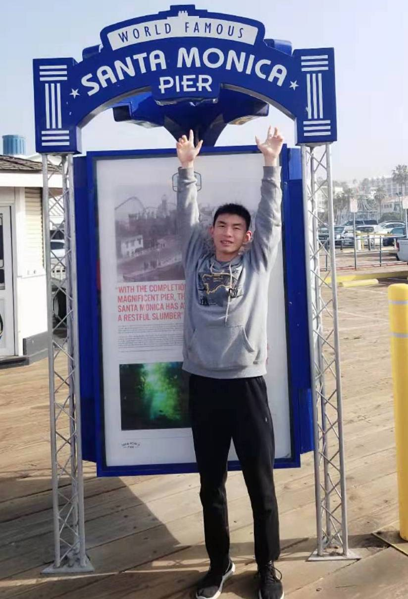

<!DOCTYPE html PUBLIC "-//W3C//DTD XHTML 1.1//EN"
  "http://www.w3.org/TR/xhtml11/DTD/xhtml11.dtd">
<html xmlns="http://www.w3.org/1999/xhtml" xml:lang="en">
<head>
<meta name="generator" content="jemdoc, see http://jemdoc.jaboc.net/" />
<meta http-equiv="Content-Type" content="text/html;charset=utf-8" />
<link rel="stylesheet" href="jemdoc.css" type="text/css" />
<title>Changhao Wang</title>
</head>
<body>
<table summary="Table for page layout." id="tlayout">
<tr valign="top">
<td id="layout-menu">

Changhao Wang

<a href="index.html" class="current">Home</a>

<a href="course.html">Coursework</a>

<a href="research.html">Research</a>

<a href="publication.html">Publication</a>

External

<a href="http://msc.berkeley.edu/">MSC&nbsp;Lab</a>

</td>
<td id="layout-content">

<h1>Changhao Wang</h1>

<table class="imgtable"><tr><td>
&nbsp;</td>
<td align="left">
<b>Changhao Wang</b> 

<a href="https://www.linkedin.com/in/changhaowang0708/">LinkedIn Profile</a> 

Department of Mechanical Engineering 

University of California at Berkeley 

<b>Email:</b> changhaowang (at) berkeley.edu 

<b>Advisor:</b> Prof. <a href="http://www.me.berkeley.edu/people/faculty/masayoshi-tomizuka">Masayoshi Tomizuka</a> 

<b>Affiliation:</b> <a href="http://msc.berkeley.edu/">Mechanical Systems Control Laboratory (MSC)</a> 

<h2>Recent News</h2>
<ol>
<li>
March 2019: Paper: Robust Deformation Model Approximation for Robotic Cable Manipulation submitted to IEEE IROS2019!

</li>
<li>
August 2018: I joined Mechanical System Control Lab at UC Berkeley as a Ph.D. student!

</li>
<li>
July 2018: Paper: A Framework for Manipulating Deformable Linear Objects by Coherent Point Drift accepted by IEEE Robotics and Automation Letters (RA-L)!

</li>
</ol>
</td></tr></table>
<h2>About me</h2>

I am a first-year Ph.D. student at UC Berkeley advised by Prof. Masayoshi Tomizuka. My research interest lies in the interdisciplinary combination of robotics, optimization, artificial intelligence and control theories with applications to robotic manipulation and motion planning.

Here is my <a href="pdf/CV_Changhao.pdf">Curriculum Vitae</a>.

<h2>Education</h2>
<ul>
<li>
<b>Ph.D. Mechanical Engineering, UC Berkeley (Berkeley, CA), 2018 - 2023 (Expected)</b>

<ul>
<li>
Major: Controls &nbsp;&nbsp;&nbsp;&nbsp;&nbsp;&nbsp;&nbsp;&nbsp;&nbsp;&nbsp;&nbsp;Minors: Optimization, Artificial Intelligence

</li>
<li>
GPA: 4.0/4.0 &nbsp;&nbsp;&nbsp;&nbsp;&nbsp;&nbsp;&nbsp;&nbsp;&nbsp;&nbsp;&nbsp;&nbsp;&nbsp;&nbsp;&nbsp;Advisor: Prof. Masayoshi Tomizuka

</li>
<li>
Research Interest: Robotics, Optimization, and Motion Planning. 

</li></ul>
</li>
<li>
<b>B.S., Mechanical Engineering, Shanghai Jiao Tong University (Shanghai, China), 2014-2018</b>

<ul>
<li>
Thesis: Vision-based Object Classification and Size Detection for Robotic Manipulation

</li>
<li>
Advisor: <a href="http://me.sjtu.edu.cn/teacher_directory1/dinghua.html">Prof. Ye Ding</a>, [http:<i></i>me.sjtu.edu.cn<i>teacher_directory1</i>shengxinjun.html Prof. Xinjun Sheng

</li>
</ul>

</li>
</ul>

Page generated 2019-03-03 00:11:04 PST, by <a href="http://jemdoc.jaboc.net/">jemdoc</a>.

</td>
</tr>
</table>
</body>
</html>
